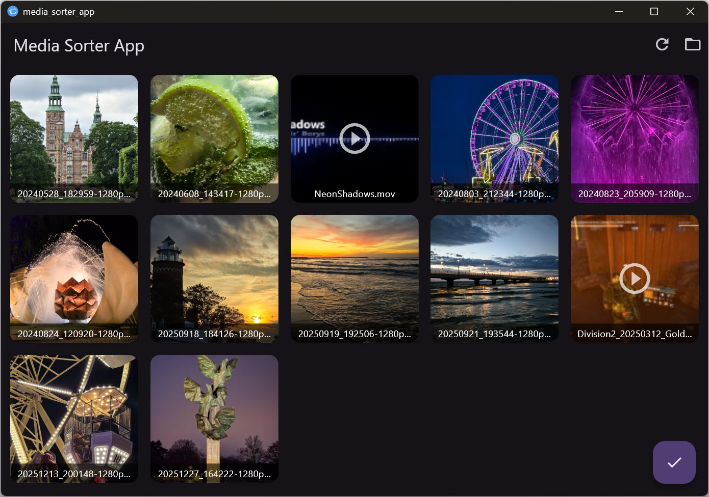

 [](https://opensource.org/licenses/MIT)

# Media Sorter App

This application was born out of my frustration trying to make an ordered list out of many image files, basing on my visual assesment of the images.
With this app, you can open a folder and see all of the images and videos in this folder - and then drag and drop them, changing their order. Upon saving, it is doing two things: 

- saves a json file with the order of the files,
- copies to a system clipboard a an ordered list of filenames, ready to be pasted somewhere (for example, to a gallery code).



## Getting Started

For debug, run
```bash
flutter run -d windows
```

To build a release version for windows, run

```bash
flutter build windows
```
